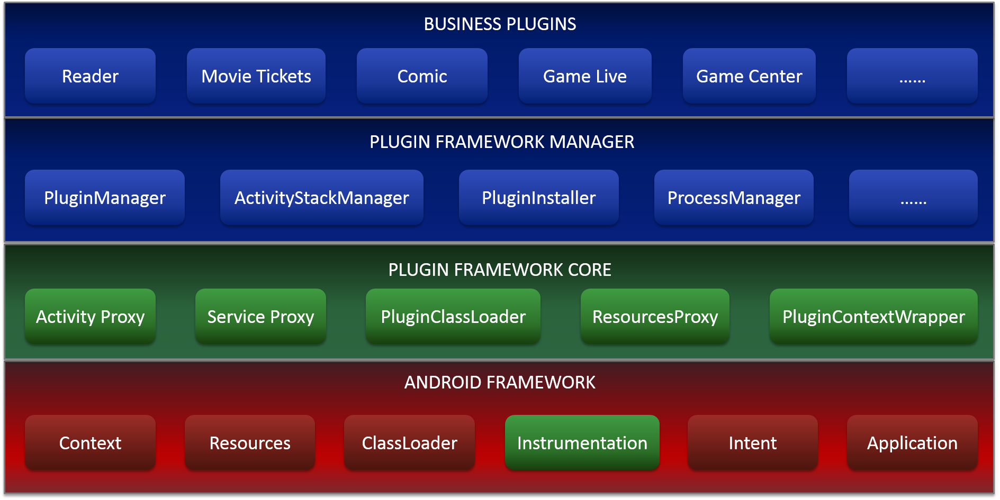

# Neptune


**Neptune is a flexible, powerful and lightweight plugin framework for Android.**

It now runs plugins dynamically on billions of devices every day and carries many separated business modules of IQIYI such as Reader, Movie Tickets and etc..

Especially, Neptune is greatly compatible with Android P . It can run on Android P devices seamlessly and stably. Only few APIs in light greylist are used.

[中文文档](README_CN.md)

# Supported Features

| Feature | Detail  |
| :------ | :-----: |
| Supported Components | Activity/Service/Receiver |
| Component registration in Host Manifest.xml | No Need |
| Share Host App Class | Supported |
| Share Host App Resources | Supported |
| Resources Isolation | Supported |
| Run individual App | Supported |
| Android Features | Almost all features |
| Compatibility  | Almost all roms |
| Process Isolation | Supported |
| Plugin Dependency   | Supported |
| Plugin Development  | like normal app |
| Supported Android versions | API Level 14+ |

# Architecture



# Getting Started

## Host Project

compile Neptune in application module of `build.gradle`.

```Gradle
    implementation 'org.qiyi.video:neptune:2.5.0'
```

Initialize sdk in your `Application#onCreate()`.

```Java
public class XXXApplication extends Application {
    
    @Override
    public void onCreate() {
        NeptuneConfig config = new NeptuneConfig.NeptuneConfigBuilder()
                    .configSdkMode(NeptuneConfig.INSTRUMENTATION_MODE)
                    .enableDebug(BuildConfig.DEBUG)
                    .build();
        Neptune.init(this, config);
    }
}
```

more details and developer guide see wiki

## Plugin Project

If plugin app wants to share resources with host app, you need add dependency in the `buildscript` block of `build.gradle` in root of plugin project as following.

```Gradle
dependencies {
    classpath  'com.iqiyi.tools.build:neptune-gradle:1.1.6'
}
```

Apply gradle plugin in application module of `build.gradle` and config it.

```Gradle
apply plugin: 'com.qiyi.neptune.plugin'

neptune {
    pluginMode = true      // In plugin apk build mode
    packageId = 0x30       // The package id of Resources
    hostDependencies = "{group1}:{artifact1};{group2}:{artifact2}" // host app resources dependencies
}
```

# Developer Guide

* [API document wiki](https://github.com/iqiyi/Neptune/wiki)
* [Host App Sample Project](samples/HostApp)
* [Plugin App Sample Project](samples/PluginApp)
* [Read SDKLibrary source code](SdkLibrary)

# Contribution

We sincerely appreciate your PR contribution of any kind , including codes, suggestions or documentation to improve our project.

# License

Neptune is [Apache v2.0 Licensed](LICENSE).

