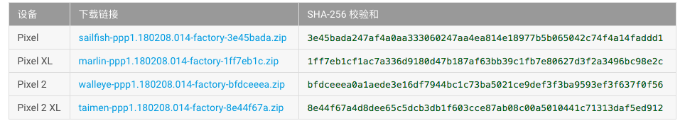
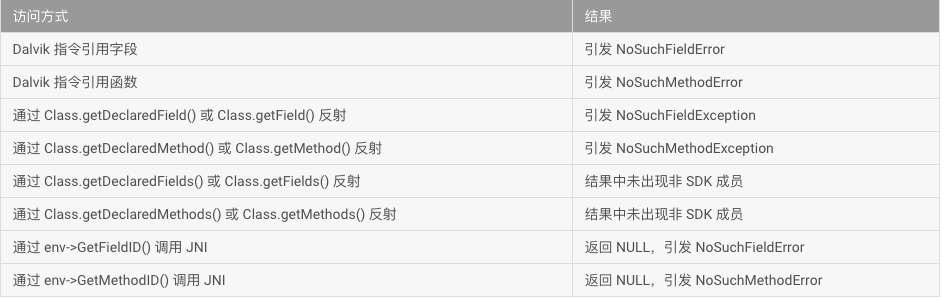

# Android 非SDK接口限制

Android P中引入了对非SDK接口限制，包括反射，JNI等直接或间接调用。参考声明
[通过减少非sdk接口提高稳性](https://android-developers.googleblog.com/2018/02/improving-stability-by-reducing-usage.html)。  

一般来说，应用应当仅使用 SDK 中正式记录的类。 特别是，这意味着，在您通过反射之类的语义来操作某个类时，不应打算访问 SDK 中未列出的函数或字段

> [官方参考地址](https://developer.android.com/preview/restrictions-non-sdk-interfaces.html#sdk_sdk)


## 一、区分 SDK 接口和非 SDK 接口

SDK是否公开查询地址：[Package Index](https://developer.android.com/reference/packages.html)

非查询地址中接口，属于限制性接口。且限制性接口会随时可能变更，Google不会通知开发者。

## 二、测试方法

目前google提供了AndroidP Preview 版本，针对Pixel手机提供了一些系统镜像。[下载地址](https://developer.android.com/preview/download.html)



目前AndroidP Preview版本，不限制任何非 SDK 接口；  
在应用访问非 SDK 接口时，打印日志并可能发出 Toast 通知。其中包含关于应用所访问的非 SDK 接口的更多详细信息，包括以 Android 运行时所使用的格式列出的声明类、名称和类型。   
日志消息还说明了访问方法：直接、通过反射或者通过JNI。以及适用的灰名单。

** 两种灰名单**
- `light greylisted` ：包含方法和字段，它们继续在Android P预览版中运行，但Google无法保证在未来版本的平台上访问这些方法和字段。
- `dark greylist`：AndroidP预览版本中无法访问的方法。

这些日志消息可以使用adb logcat访问，并且会显示在正在运行的应用程序的PID下。日志中的条目可能如下所示：

```xml
Accessing hidden field Landroid/os/Message;->flags:I (light greylist, JNI)
Accessing hidden method Landroid/app/ActivityThread;->currentActivityThread()Landroid/app/ActivityThread; (dark greylist, reflection)
```

## 三、调用非SDK接口报错

后续版本中，不同类型的调用隐藏API会报错：



## 四、插件中用到的反射
编号|API|内容
-| :-| :-:|
1|Acitivty 中 Internal API : "attach","performStart","performResume","performStop","performRestart","performPause","onActivityResult"|派发插件事件和控制插件生命周期
2|Activity 中 getField internal 变量 :“mMainThread”，“mInstrumentation”|控制插件Activity生命周期
3|Activity set 属性:"mDecor",""mHasCurrentPermissionsRequest","mWindow",""mWindowManager""|Activity相关属性
4|Instrumentation 中 "execStartActivity", 6.0以下 “execStartActivityAsCaller”|模拟启动
4|Service 中 getField internal 变量:"mThread","mToken","mActivityManager"|进程的Service代理
5|Service 中的 Internal API:"attach"|进程的Service代理
6|AssertManaer @hide API "addAssetPath"|创建插件的Resource,插件可以访问主工程和插件的资源
7|“android.app.ContextImpl$SharedPreferencesImpl”，“"android.app.ContextImpl"”，“"android.os.FileUtils$FileStatus"”，"com.android.internal.util.XmlUtils"，"android.app.SharedPreferencesImpl"|获取插件SharedPrefereces
8|"dalvik.system.BaseDexClassLoader","dexElements"，"mPaths"，"mDexs"等属性|插入dex
9|“android.content.pm.PackageParser”,"parsePackage","activities","intents"等属性|解析Manifest


## 四、访问隐藏API
目前360提出的访问系统API核心思想：
- 系统必须区分一个 Method（或 Field）对用户代码是隐藏的还是公开的。只有隐藏的才需要进行限制
- 必须区分调用者的身份：是用户代码调用的还是系统代码（例如 Activity 类）调用的。只有用户代码调用时才需要进行限制。

系统源码地址：
- [hidden_api.cc](https://android.googlesource.com/platform/art/+/master/runtime/hidden_api.cc)
- [hidden_api.h](https://android.googlesource.com/platform/art/+/master/runtime/hidden_api.h)

方法|做法|能力|限制
-|:-|:-|:-|
模拟系统方法|对于不在 SDK/platforms/android-xx目录下的源码，采用自定义provided依赖，直接调用的方式|实现起来非常简单方便，并且稳定性很好。|只能调用访问权限为 public 和 default 的 Method 和 Field，不能直接调用 protected 和 private 的。
模拟系统调用|将APK中反射类的的 ClassLoader 改为 BootStrapClassLoader|能够调用所有隐藏 API；仅需要寻找两个导出函数，适配性较好；没有使用 Hook，稳定性好|JNI 方式获取 Method 和 Field 时也需要转到 ReflectionHelper 工具类完成
修改源码属性|修改被隐藏的 Method 或 Field 对应的access_flags，去掉其隐藏属性|原有代码无需修改，适用于原有代码量较多的情况|需要使用 Hook，实现难度较大


参考：
- https://mp.weixin.qq.com/s/53Fs8WVTkRn69wpvLDzaxw
