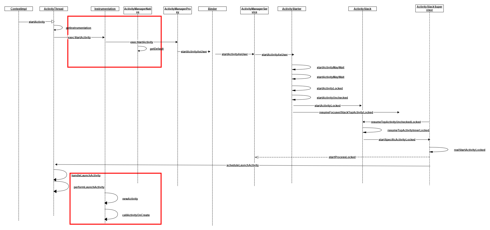
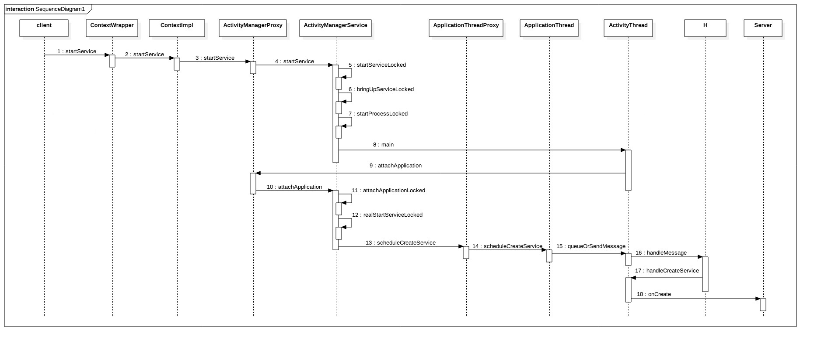

## 插件框架运行机制及原理

#### 组件的代理

我们的插件化框架采用的是静态伪代理的方式，绕开系统的限制，让插件的组件充满活力，下面从Activity、Service、BroadcastRecevier三个方面介绍其实现原理，ContentProvider目前没有实现。

##### Activity的代理实现

我们先来看一下Activity的启动流程

在Android中，我们一般要启动一个Activity，会调用类似的代码

```java
Intent intent = new Intent(ActivityA.this, ActivityB.class);
context.startActivity(intent);
```

这样的代码，最终的调用流程如下图，基于Context的类型不同，调用链上略有差别；如果Context是Activity，Activity内部持有一个Instrumentation，会直接调用`Instrumentation#execStartActivity()`启动目标Activity；如果Context是Service或Application，则会通过其Base Context（即ContextImpl）间接调用`Instrumentation#execStartActivity()`启动目标Activity。



Activity启动过程主要流程有如下几步：

1. 调用startActivity，直接或间接执行Instrumentation的execStartActivity()方法
2. Instrumentation通过aidl和binder进行跨进程通信，调用到系统服务AMS进程的startActivity方法
3. AMS会先判断权限，校验Activity的合法性，然后调用ActivityStackSupervisor和ActivityStack进行一系列的交互来确定和管理Activity的栈
4. AMS通过ApplicationThread进行跨进程通信，重新回调到App进程的ActivityThread端
5. 通过ActivityThread中的H类（一个Handler实例）发送消息驱动，执行`ActivityThread#handleLaunchActivity()`方法，会再次调用`Instrumentation#newActivity()`来创建Activity并实例化
6. 然后调用Activity#attach()方法初始化Activity的基本信息，接着调用`callActivityOnCreate`来唤醒Activity，走到`Activity#onCreate()`生命周期回调

这里的关键点在于第3步，AMS所做的校验主要就是判断当前需要启动的Activity是否被系统安装过，如果没有就会抛出ActivityNotFoundException。**解决思路**就是在startActivity时将Intent中实际跳转的插件的Activity替换成占坑的代理Activity，骗过系统AMS进程的校验；等Intent再次传递到App端启动Activity时，再将代理Activity还原成真实的插件Activity，从而给插件Activity注入了生命周期。

在启动Activity一端，通过hook Instrumentation的execStartActivity()把intent中的插件Activity替换成代理的Activity，让系统去启动代理的Activity；

再次回到App端初始化Activity时，有好几种hook方式可以实现：

1. hook Instrumentation的newActivity方法，在调用Instrumentation的newActivity方式时直接使用插件ClassLoader中创建插件的Activity，滴滴的VirtualApk采用的就是这种方式
2. hook ClassLoader的loadClass和findClass方法。这是因为newActivity方法的内部实现就是调用ClassLoader的loadClass方法完成需要启动的Activity的类加载和实例化的；360的Replugin采用的就是hook Classloader实现的。
3. 伪代理模式（非hook方式），让系统完全初始化并启动代理Activity，然后在代理Activity的onCreate中拿到系统赋予插件Activity的属性，插件框架手动load插件的Activity并实例化，然后调用插件Activity的attach方法，将这些属性与插件Activity绑定，并调用插件Activity的onCreate完成初始化。同样的，然后在代理Activity的每个生命周期方法中同样调用插件Activity的生命周期回调一遍。所以在系统的栈中，永远都是代理Activity，而代理Activity只是一个空壳。

Android P出来之前，Neptune插件框架采用的就是方案3，其主要步骤如下：

**Step1**: 拿到Intent之后，调用ComponentFinder的switchToActivityProxy，获取到能够处理当前Intent的Activity对应的类名，保存为targetActivityClass

**Step2**: 将Intent代表的组件替换成代理Activity的信息，代理Activity有InstrActivityProxy1，InstrActivityProxyHandleConfigChange1，InstrActivityProxyLandscape1，InstrActivityProxyTranslucent1，通过解析targetActivityClass的设置的属性，选择不同的代理Activity,并将targetActivityClass通过Intent传递给代理Activity

**Step3**: 由于代理Activity已经在宿主的AndroidManifest中声明(声明在了pluginsdk.aar),所以启动了代理Activity，在代理Activity的onCreate方法中解析targetActivityClass的值，并通过反射创建真正的Activity，保存为pluginActivity

**Step4**: 反射调用pluginActivity的attach方法，将代理Activity的属性赋值给pluginActivity，这里有两个属性比较重要：BaseContext, Instrumentation

**Step5**: 在代理Activity生命周期方法上调用pluginActivity的生命周期方法,实现生命周期管理

**Step6**: 通过step 4,替换了PluginActivity的Instrumentation，Activity的跳转都需要通过这个类，替换之后的Instrumenttation是插件sdk自定义的PluginInstrumentation，里面改写了execStartActivities方法，对启动逻辑进行拦截，接下来重复step 1

Android P之后，由于非公开SDK调用的限制，我们调整了策略，采用了hook Instrumentation的方案，基本步骤如下

**Step1**: 进程初始化时，替换ActivityThread#mInstrumentation为自定义的NeptuneInstrumentation

**Step2**: 启动插件Activity之前，调用ComponentFinder的switchToActivityProxy，替换成代理Activity坑位

**Step3**: 创建代理Activity时，在Instrumentation#newActivity中把代理Activity创建换成创建插件真实的Activity，返回给系统；后续Activity的生命周期调用都会分发给插件Activity

**Step4**: 在Instrumentation#callActivityOnCreate中替换插件Activity的BaseContext，资源，ActivityInfo等属性，这样插件Activity就具备了活力


##### Service的代理实现

我们先来看一下Service的启动流程，Service的启动有两种方式startService和bindService，这里简单介绍一下startService的流程



Service的启动流程和Activity非常类似，主要过程有以下几步：

1. 调用startService, 会执行ContextImpl的startService方法
2. ContextImpl通过binder进行跨进程通信，调用到系统服务AMS进程的startService方法
3. AMS进程校验Service的权限和合法性，通过校验之后会通过ApplicationThread再次回调到App进程
4. 通过Activity的H类（Handler实现）发送消息驱动，调用ActivityThread#handleCreateService创建Service实例，并回调Service#onCreate方法

binderService的流程和startService类似，只是调用的方法不同，多了ServiceConnection的回调分发。

因此需要绕开AMS对Service的校验，达到欺骗系统的目的，和插件Activity的实现原理类似，也是使用代理Service占坑的方式。Service和Activity唯一的区别就是多次启动同一个Service，只会生成一个Service实现，Service#onCreate()只会回调一次。在startService之前，替换Intent中的目标Service为代理占坑的Service，在代理Service中再托管插件真实Service的生命周期，需要注意的是，由于占坑Service会被启动N次，只能在onStartCommand方法中代理插件Service的生命周期活动

目前的插件框架，启动Service的逻辑主要步骤如下：

**Step1**: 拿到Intent之后，调用ComponetFinder的switchToServiceProxy，获取到能够处理当前Intent的Service对应的类名，保存为targetService

**Step2**: 将Intent 代表的组件替换成代理Service的信息，代理Service比代理Activity简单，只要根据插件的进程选择代理（ServiceProxy0，ServiceProxy1，ServiceProxy2），并将targetService传入代理Service

**Step3**: 同样代理Service配置在宿主的AndroidManifest中，通过这个Intent可以拉起代理Service,并在onStartCommand/onBind中解析targetService.反射创建targetService对象，并调用attach方法将代理的token传给插件Service

**Step4**: 如果发现启动的targetService没有启动过那么先加载，然后调用targetService的onCreate方法，然后调用onStartCommand/onBind，如果targetService之前启动过，那么直接调用onStartCommand/onBind方法


##### Receiver的实现

BroadcastReceiver组件和Activity/Service差别较大，广播并没有复杂的生命周期，，它的整个存活过程就是一个onReceive回调。Android广播分为静态广播和动态广播两种。静态广播是声明在AndroidManifest之中的，在apk安装到设备上之后，PMS自动注册到系统中的；而动态广播是我们在代码中显式调用Context#registerReceiver()注册的，只在App生命周期内有效。而插件的静态广播是没有声明在宿主的AndroidManifest中，系统自然无法为其注册。静态广播是需要声明Intent-Filter，在系统进行广播分发时进行匹配，而宿主无法预先知道插件的Recevier声明了哪些Action，无法使用代理实现。折中的方案，就是在加载插件时，解析插件AndroidManifest中的静态广播，转换为动态广播进行注册。


