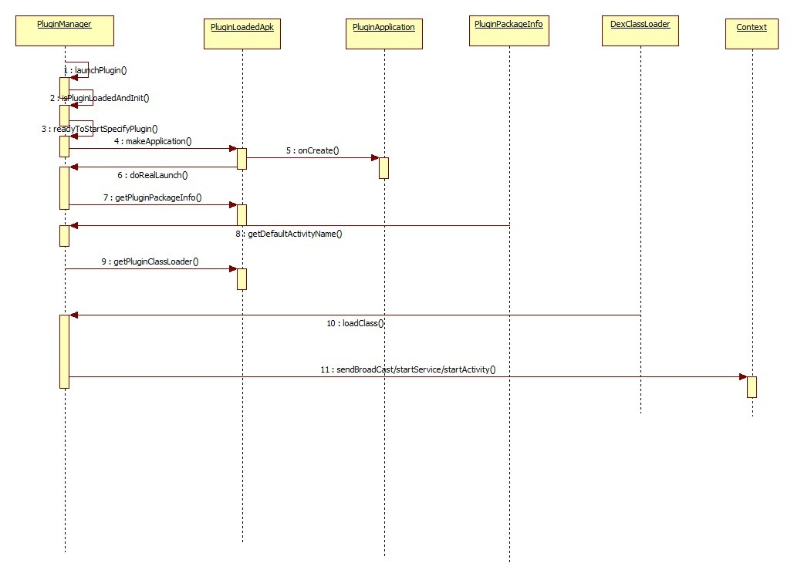
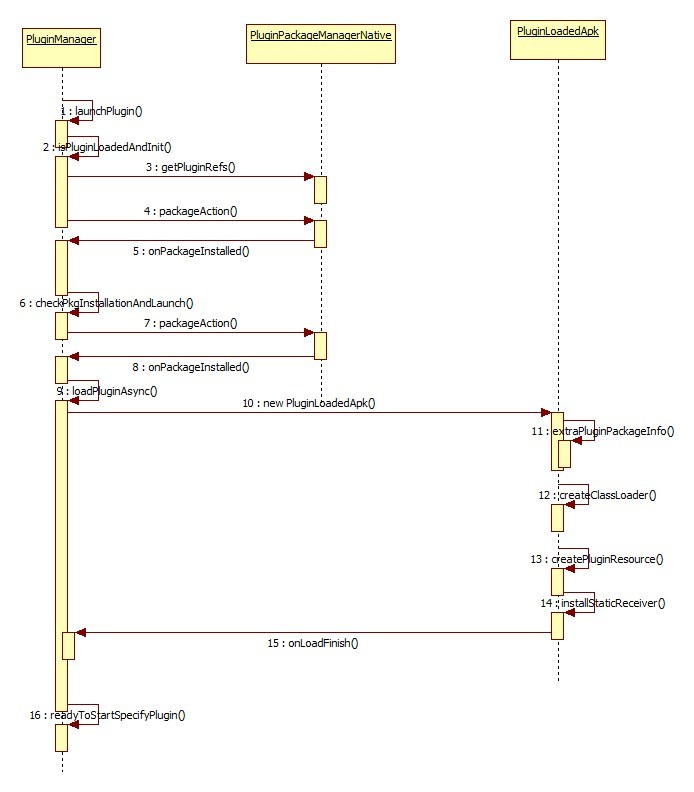

## 插件框架运行机制及原理

#### 插件的启动

插件内的组件跳转和原生Android开发类似，基线跳转插件，需要使用PluginManager#launchPlugin()手动加载并启动插件。

插件已经加载过的启动流程，即内存中已经存在插件关联的PluginLoadedApk（热启动）
直接通过插件ClassLoader加载相应的组件类，然后将Intent替换成代理占坑的Activity/Service, 然后交给系统处理

插件未加载过第一次启动流程，即内存中没有插件关联的PluginLoadedApk（冷启动）
1. 判断插件是否安装，如果未安装，则先执行安装流程
2. 初始化PluginLoadedApk对象，创建ClassLoader、插件Resource对象以及PluginContextWrapper
3. 安装静态广播，调用makeApplication创建插件的Application，调用其onCreate()方法

