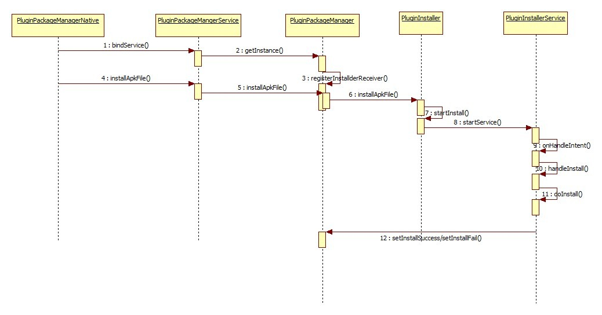
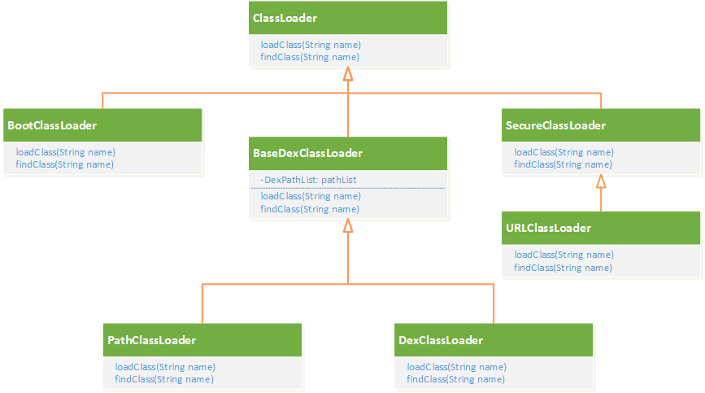
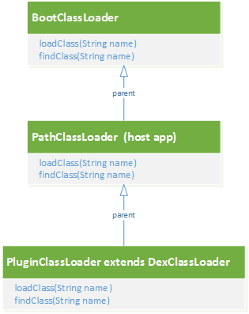

## 插件框架运行机制及原理

#### 安装与卸载

插件的安装通过运行在独立进程的Service完成，主要防止部分机型dexopt hang住主进程。
插件的安装分为内置插件（asset目录，sdcard）和线上插件两部分。

* 内置插件：
    - 约定存放在assets/pluginapp/&lt;plugin_pkg_name&gt;.apk形式，安装时解压到/data/data/&lt;host_pkg_name&gt;/app_pluginapp目录
    - sdcard插件，允许调试模式下安装，以&lt;plugin_pkg_name&gt;.apk命名
* 线上插件：直接将插件下载到sdcard目录上，然后拷贝到/data/data/&lt;host_pkg_name&gt;/app_pluginapp目录下；为了减少拷贝操作，可以直接下载到/data/data/&lt;hots_pkg_name&gt;/app_pluginapp目录；

插件安装过程主要执行以下几步：

1. 拷贝apk到内置存储区，重命名为&lt;plugin_pkg_name&gt;.apk
2. 解压apk中的so库到app_pluginapp/&lt;plugin_pkg_name&gt;/lib目录
3. dexopt优化插件dex，Android 7.0以上第一次会使用解释模式执行dex，优化加载速度





插件的卸载并不是真正意义上的卸载，只会删除apk、so、dex相关文件，保留原有的插件数据。


#### 插件的加载

插件中的类和资源在宿主App中都不存在，四大组件也没有在AndroidManifest中注册，自然也不会被系统安装，只是放置在宿主App设备上的一个apk包。所以需要插件框架来辅助完成一些工作，所有的插件框架都需要解决以下三个问题：

1. 插件代码的加载
2. 插件资源的加载
3. 插件组件的生命周期

##### 插件代码的加载

Java中的类都是通过ClassLoader加载的，而Android中类的加载也离不开ClassLoadder。在Android系统中，主要的ClassLoader有三个

* BootClassLoader：Android系统启动时用来预加载常用的类
* PathClassLoader：用来加载系统和应用程序中的类，如果是非系统应用程序类，则会加载/data/app目录下的dex、apk或jar文件
* DexClassLoader：可以加载指定路径的dex、apk或jar文件，支持从SD卡进行加载，是插件化的技术基础

Android系统中类的继承关系如图



关于插件中类的加载机制有两种处理方式，一种是单类加载机制，另一种是多类加载机制；单类加载器机制，即所有插件APP的类都通过宿主的ClassLoader（即PathClassLoader）进行加载，与MultiDex、Qzone热修复技术类似，通过Dex前插后者后插的方式实现。采用单类加载器模型，随着业务团队和插件的增加，很容易出现类重复问题，无法保证所有类都是独一无二的。多类加载器机制是指每个插件都由一个新的类加载器实例来加载，组件间的类是完全隔离，不能直接互相访问。

目前我们插件的框架采用的是多类加载器模型，各个插件业务方完全独立，插件只能访问宿主App中的类。



##### 插件资源的加载

Android APP运行除了类还有资源，运行时需要加载资源；对于Android来说，资源是通过AssetManager和Resources这两个类管理。App在运行时查找资源是通过当前Context的Resource实例中查找，在Resource内部是通过AssetManager管理当前的资源，AssetManager维护了资源包路径的数组。插件化的原理，就是将插件的资源路径添加到AssetManager的资源路径数组中，通过反射AssetManager的隐藏方法addAssetPath实现插件资源的加载。

```java
try{
    AssetManager am = AssetManager.class.newInstance();
    Method addAssetPath = AssetManager.class.getDeclaredMethod("addAssetPath", String.class);
    addAssetPath.setAccessible(true);
    addAssetPath.invoke(am, pluginApkPath);
    Resources pluginResources = new Resources(am, hostResource.getDisplayMetrics(), hostResources.getConfiguration());
} catch (Exception e) {
    e.printStackTrace();
}
```

各种插件化方案的资源加载原理都是一样，区别主要在于不同插件的资源管理，是公用一套资源还是插件独立资源，插件和宿主的资源访问ID冲突问题。

* 公用一套资源需要采用固定资源id及ID分段机制避免冲突
* 独立资源方案，不同插件管理自己的资源

##### 插件组件的生命周期

对于Android来说，很多系统组件（Activity、Service、BroadcastReceiver、ContentProvider）都是有生命的；类加载成功之后，插件框架还需要给它们注入活力，管理组件的生命周期。

正常启动一个Activity/Service，AMS进程都会对Activity/Service的合法性进行一些校验，而插件的Activity/Service都没有在AndroidManifest中注册过，直接启动必然会失败，因此需要在宿主中预先注册一些占坑的Activity/Service组件。

主流实现方案的过程都是靠**欺上瞒下，坑蒙拐骗**来实现，根据hook机制的差异分为两类：

* 动态代理和Binder Hook（AMS/PMS)方式，如360的Droid Plugin方案等
* 静态代理，占坑方式实现偷梁换柱，如滴滴的VirtualApk等


